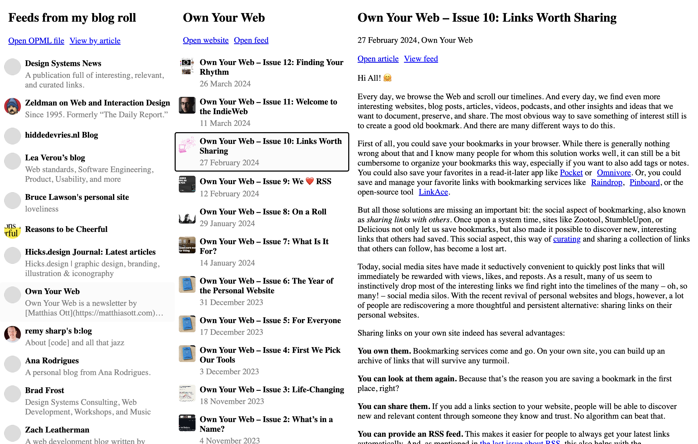

# \<opml-reader>

Turn a link to an OPML file into an RSS reader that showcases the content of the feeds in the OPML file. The reader is responsive and minimally-styled to fit in the surrounding page. 

```xml
<opml-reader>
  <a type="text/x-opml" href="">OPML file of my blog roll</a>
</opml-reader>
```

Becomes:




## Usage

Wrap the component around fallback content that will be displayed where JavaScript is not available. Make sure the fallback content contains a link to an OPML file with `rel="text/x-opml"`.

```xml
<opml-reader>
  <p>
    Download <a type="text/x-opml" href="">an OPML of my fav blogs</a>.
  </p>
</opml-reader>
<script type="module" src="/path/to/opml-reader.js"></script>
```

### You'll likely need to proxy the feeds
Due to CORS restrictions in the browser, it's unlikely that all the RSS feeds will be available to load directly from their source servers. To overcome this restriction, you could setup a proxy on your own server and pass the URL, using `${url}` in place of the URL to be proxied.

```xml
<opml-reader proxy-url="/proxy?url=${url}">
  <!-- ... -->
</opml-reader>
```


#### There are some free CORS proxies available
If you're not able to setup your own proxy server, there are some others available for free. There may be some restrictions, such as rate-limiting, so do check out the information on their sites first.

- [corsproxy.io](https://corsproxy.io/)
`proxy-url="https://corsproxy.io/?${url}"`

- [thingproxy](https://github.com/Freeboard/thingproxy)
`proxy-url="https://thingproxy.freeboard.io/fetch/${url}"`


## Styling

You can style most of the elements of the reader directly, as they reside in the light DOM. There are, however, a few custom properties used in the reader that may be useful.

**_`--opml-avatar-background-color`_**
The colour used to fill avatars, when no avatar image is set in a feed.

**_`--opml-background-color`_**
The colour used as the background when parts of the UI overlap in narrow viewports.

**_`--opml-focus-color`_**
The colour used to highlight keyboard focus.

**_`--opml-highlight-color`_**
The background colour used to highlight selected items.

**_`--opml-link-color`_**
The colour used to denote links (and buttons styled as links).


## Contributing

[Enhance](https://enhance.dev/) is used as the development environment. You should be able to run this locally with:

```shell
npm init
npm start
```

### Interesting files
**_`/app/api/proxy.mjs`_**
The proxy script used in development.

**_`/app/browser/*`_**
All the commponents used in the reader.

**_`/public/demo.opml`_**
The OPML file used in development.

**_`/test/*`_**
Tests (run with `npm test`).

**_`/opml-reader.js`_**
The location where the shipped component is built.

### Build
Build the component scripts into a single shippable file with:

```shell
npm run build
```


---
Written by [@paulcuth](https://mastodon.social/@paulcuth) as part of an initial exploration into developing [Web Components](https://developer.mozilla.org/en-US/docs/Web/API/Web_Components).